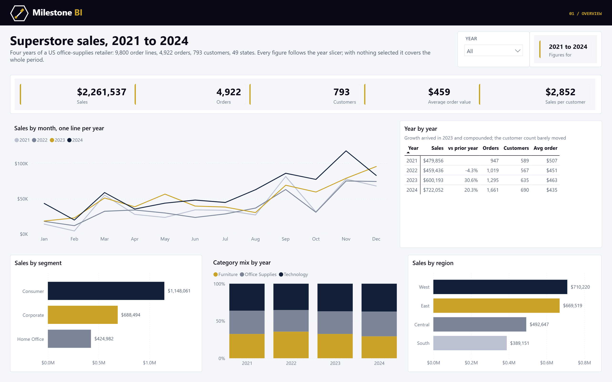
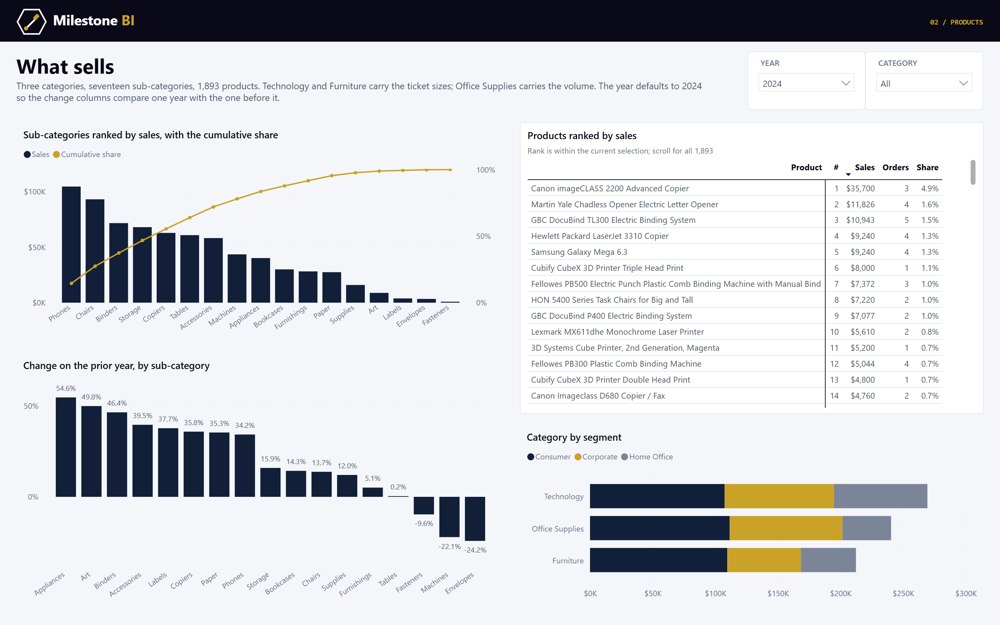
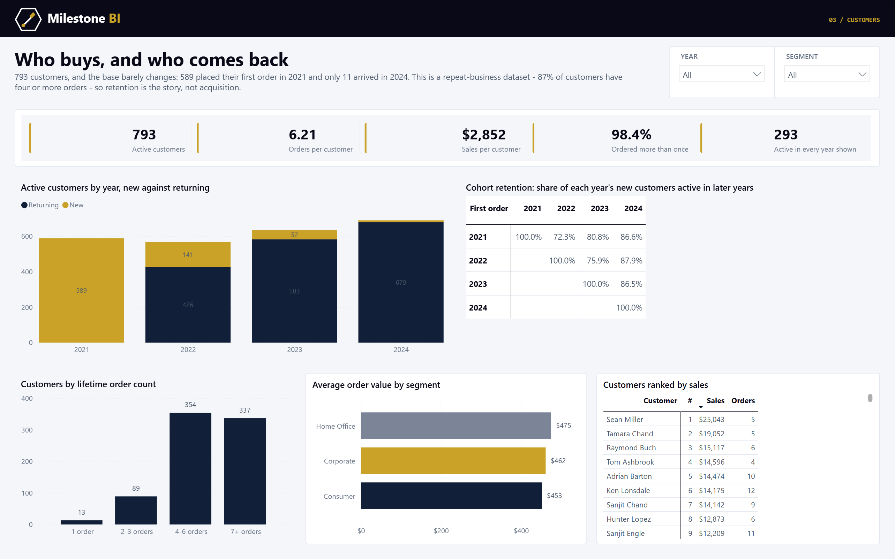
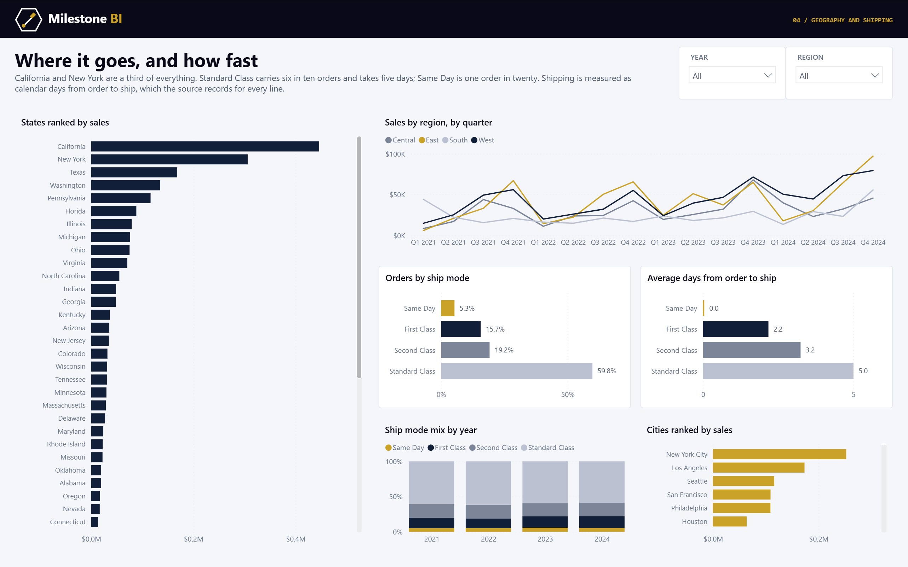

# Superstore Sales

A Power BI report on four years of a US office-supplies retailer's orders — the sample every
Power BI course starts on, rebuilt properly. A star schema with a marked date table, forty measures
that were checked against pandas before anything was drawn, and a four-page report in the
Milestone BI palette.



## Where the data comes from

**Source: [Superstore Sales Dataset](https://www.kaggle.com/datasets/rohitsahoo/sales-forecasting)
on Kaggle** — the 18-column extract of Tableau's Superstore sample: 9,800 order lines, 4,922
orders, 793 customers, 1,893 products, 49 states. It carries sales but not profit, quantity or
discount, so the report can say what sold and to whom, not what it earned.

> **Licence.** Kaggle lists the dataset under GPL-2, which permits redistribution, so both the
> source file and the star schema derived from it are committed under `data/` — clone the repo and
> the model has everything it needs.

**The dates were moved.** The extract covered 2017–2020. `etl/shift_dates.py` moved every order
and ship date forward four whole years so the report reads as 2021–2024. The gap between order and
ship is untouched, and 29 February 2020 lands on 29 February 2024, which exists. The year token
inside each Order ID (`CA-2015-103800`) already trailed its order date by two years and was
re-synced to the shifted year, or it would have sat six behind.

| | |
|---|---|
| Fact rows | 9,800 order lines, $2,261,536.78 — foots to the source to the cent |
| Orders | 4,922 (an order averages two lines) |
| Period | 3 January 2021 to 30 December 2024 |
| Customers | 793, in three segments |
| Products | 1,893 (ID, name) pairs across 17 sub-categories |
| Geography | 628 places in 49 states and four regions |

## What the ETL found

None of this is visible until you go looking, and all of it changes the answer.

**Product ID is not a key.** 32 IDs carry two different product names, and 16 names sit under two
IDs. Keying on either merges products that differ or splits ones that do not, so the product
dimension is the (ID, name) pair with a surrogate key. Product ID stays visible for reference.

**Postal codes lost their leading zero.** The source stored them as numbers, so 429 New England
and New Jersey codes arrived four digits long (`1841` for Lowell MA, which is `01841`). They are
text again, padded back to five. Eleven rows — all Burlington, Vermont — have no code at all and stay
blank rather than being looked up.

**Customers have no address.** 777 of 793 customers order from more than one state. Geography
belongs to the order line, not the customer, and the model is built that way: a customer dimension
with a state on it would have been wrong for nearly all of them.

**The customer base is closed.** New customers fall from 589 in 2021 to 141, 52 and 11, and
retention *rises* over time. Neither happens in a real business; both happen when a sample is drawn
by order rather than by customer. The customer page is built around retention because that is the
only customer story this data can honestly tell.

**Order-to-ship is recorded for every line.** Zero to eight days, mean 3.96, and it never goes
negative — the one thing about the dates that needed no cleaning.

## The model

Six tables around one fact, plus a measure table.

```
    Date ────────┐
    Customer ────┤
    Product ─────┼──────► Sales   (one row per order line)
    Geography ───┤
    Ship Mode ───┘
```

**The date table is marked.** One row per day, 2021 to 2024, contiguous, `dataCategory: Time` —
so `DATEADD` and `TOTALYTD` walk a real calendar. Without the marking `Sales PY` returns blank for
every row and the year-over-year column quietly looks like 2021 forever.

**The fact is hidden end to end.** `Sales[Sales]` is the only amount, and the measures own how it
is aggregated: distinct orders rather than rows, customers counted on the fact so every filter
narrows them, shares computed against a denominator that clears the right filters.

### The measures worth looking at

**`New Customers` filters the fact, not the dimension.** It takes the period's first and last date
and keeps customers whose `First Order Date` falls between them — so a product or region on the
visual still applies and the number becomes "new customers who bought this".

**`Retention %` on a cohort × year matrix.** `Cohort Size` clears the date filter so the
denominator is the whole cohort whatever year the column is; the cohort's own year is 100% by
definition and earlier years are blank.

**`Customers Active Every Year` counts years on the fact.** The first version counted
`DISTINCTCOUNT('Date'[Year])` and returned 793 — the whole calendar for every customer, because a
fact table cannot filter its dimension. `SUMMARIZE(Sales, 'Date'[Year])` returns 293. The number
looked perfectly plausible on screen; the pandas cross-check is what caught it.

**`Standard Class Share` uses `KEEPFILTERS`.** Without it the filter would overwrite a ship mode
already on the visual and repeat the grand total down a breakdown. The verification query checks
that the share differs by region, which it must.

**`Cumulative Sales Share` is the Pareto line.** For each sub-category, the share of sales from it
and every sub-category selling more than it — so on a chart sorted by sales it climbs from 14% to
100%, and the point where it crosses two-thirds is five bars in.

## The report

Four pages, 1440 × 900, in the Milestone BI palette — near-black indigo, gold, and the site's
greys — with the brand mark in a band across the top of every page.

**01 Overview** — headline figures, sales by month with one line per year, a year-by-year table,
and sales by segment, category mix and region.

**02 Products** — sub-categories ranked with the cumulative share, change on the prior year (the
year slicer defaults to 2024 so this has a prior year), every product ranked, and category by
segment.



**03 Customers** — active, new and returning customers by year, cohort retention, customers by
lifetime order count, average order value by segment, and customers ranked.



**04 Geography and shipping** — every state ranked, region by quarter, ship mode share and days to
ship, ship mode mix by year, cities ranked.



### Some of what it says

| | |
|---|---|
| Sales, 2021–2024 | $2,261,537 in 4,922 orders — $459 an order |
| 2024 against 2023 | +20.3%, after +30.6% the year before and −4.3% the year before that |
| Customers | 793, of whom 98.4% ordered more than once and 293 ordered in every one of the four years |
| Retention of the 2021 cohort | 72% in 2022, 81% in 2023, 87% in 2024 |
| Top sub-categories | Phones and Chairs, 14% each; five sub-categories are 55% of 2024 |
| Top states | California 19.7%, New York 13.6%, Texas 7.5% |
| Shipping | Standard Class is 59.8% of orders at 5.0 days; Same Day is 5.3% at 0.0 |
| Top product | Canon imageCLASS 2200 Advanced Copier, $61,600 on three orders |

## Rebuilding

The model reads its CSVs straight from this repository over HTTPS, so there is no path to repoint:
open `Superstore Sales.pbip` in Power BI Desktop and refresh. Desktop asks once per machine to
confirm anonymous access to `raw.githubusercontent.com`.

Rebuilding the data, model or report from scratch:

```bash
python etl/shift_dates.py <kaggle-train.csv> data/source/Sales.csv --years 4
python etl/build_star_schema.py   # re-derives data/ from data/source/ (needs pandas)
python etl/build_model.py         # regenerates the TMDL model (--local to read data/ from disk)
python etl/build_report.py        # regenerates the PBIR pages, theme and brand mark
```

### Checking your work

```bash
# TMDL parses? Desktop's failure mode for malformed TMDL is a blank window and no error.
powershell -File etl/check_tmdl.ps1

# PBIR valid?
powerbi-report-author validate "Superstore Sales.pbip"

# With the PBIP open in Desktop: load the data, then read the measures back out of the live
# model and compare with the same figures computed in pandas with no DAX involved.
powershell -File etl/refresh_model.ps1
powershell -File etl/verify_measures.ps1
python etl/verify_expected.py
```

Every figure in `verify_measures.ps1` matched `verify_expected.py` to four decimal places — after
the one that did not was fixed.

## Repository layout

```
data/source/Sales.csv             the extract, dates shifted to 2021-2024
data/                             the star schema the model loads
etl/shift_dates.py                the +4 year shift, with the Order ID re-sync
etl/build_star_schema.py          cleaning and dimensional build, with assertions
etl/build_model.py                generates the TMDL semantic model
etl/build_report.py               generates the PBIR report definition, theme and brand mark
etl/build_web_data.py             emits the compact JSON the milestonebi.com page reads
etl/crop_screenshots.py           crops Desktop captures to the report canvas
etl/check_tmdl.ps1                parses the TMDL with Desktop's own serializer
etl/refresh_model.ps1             refreshes the open model over its local XMLA endpoint
etl/verify_measures.ps1           reads the measures back out of the live model
etl/verify_expected.py            the same figures from the CSVs, in pandas
web/superstore-sales.json         the page's data - about 100x smaller than the star schema
Superstore Sales.SemanticModel/   TMDL: 7 tables, 40 measures
Superstore Sales.Report/          PBIR: 4 pages, 54 visuals, theme, brand mark
```

Both the model and the report are generated rather than hand-edited. TMDL is indentation-sensitive
and forbids blank lines inside an object; PBIR wraps every property in an envelope whose type
suffix is load-bearing. Generating both keeps those rules in one place and lets the schema and the
pages read as what they are.

## The same report, on the web

The charts at
**[milestonebi.com/superstore-sales](https://www.milestonebi.com/superstore-sales/)** are this
report redrawn as hand-written SVG, reading `web/superstore-sales.json`. That file is generated by
`etl/build_web_data.py` from the same star schema with the same definitions as the DAX measures, so
the two agree to the cent.

## Licence

Code in this repository is MIT (see [LICENSE](LICENSE)). The data under `data/` is redistributed
under the GPL-2 licence Kaggle lists for the dataset, and originates from Tableau's Superstore sample.
